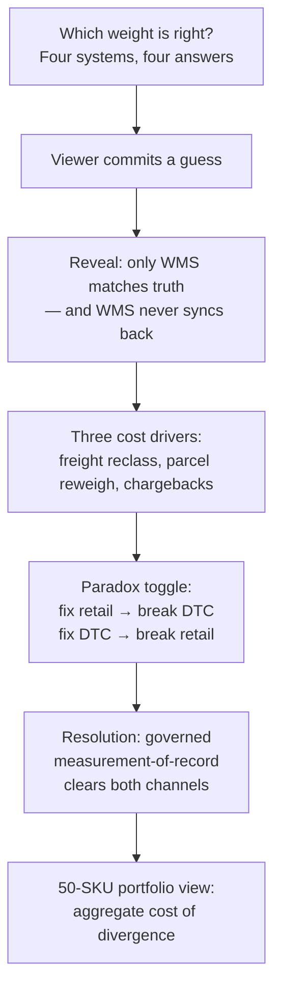

# Dimension & Weight Integrity

## Summary

A Cinderhaven Data Platform piece that quantifies the cost of inconsistent product dimension and weight data across four systems (ERP, WMS, GDSN, DTC). Delivers a discovery-narrative frontend where the viewer guesses which system holds truth, sees the per-channel cost of divergence, experiences the localization paradox (fixing one channel breaks the other), and discovers that only a governed measurement-of-record resolves both. Built on real platform infrastructure covering all 50 Cinderhaven SKUs.

---

## Problem Frame

Specialty food brands manage product physical attributes — case weight, dimensions, Ti/Hi — across multiple systems. ERP stores estimates entered at product setup. The 3PL warehouse management system stores dock-scan measurements. GDSN/IX-ONE publishes data to retailers, often padded to "safe outer box" dimensions. Shopify stores whatever someone typed into the ship-weight field, usually the net weight of the product without packaging.

Each system was populated independently, by different people, at different times, for different purposes. The numbers diverge silently. No system flags the inconsistency because no system sees the others.

The divergence drives cost through three channels. LTL freight classification depends on case density — wrong dimensions mean wrong density, wrong NMFC class, and higher rates on every pallet shipped. Parcel carriers reweigh DTC packages and back-bill the difference when Shopify understates the weight. Retailers audit inbound cases against published GDSN data and issue compliance chargebacks when published dimensions don't match physical measurements.

The structural trap: fixing one system's data can worsen another system's cost. Aligning GDSN to physical measurements changes the published density, potentially pushing freight class up across all distributors. Correcting Shopify to actual parcel weight raises the quoted shipping cost customers see at checkout. No single-system fix clears both channels.

---

## Actors

- A1. Portfolio viewer: Prospective client or industry peer evaluating Lailara's data engineering capabilities. Experiences the discovery narrative.
- A2. Ops/finance practitioner: CPG operations or finance professional who recognizes the dimension divergence problem from their own experience. The secondary audience who'd want a version of this tool.
- A3. Cinderhaven Data Platform: The existing infrastructure (Postgres + dbt + Dagster) that this piece extends with physical-attribute models and cost computations.

---

## Key Flows

- F1. Discovery journey (hero SKU)
  - **Trigger:** Viewer lands on the piece
  - **Actors:** A1
  - **Steps:**
    1. Four systems present different weights and dimensions for CH-MAR-16 (Cinderhaven Spicy Marinara, 16 oz, 12-count case). The viewer is asked "Which weight is right?"
    2. Viewer commits an answer. Reveal: only WMS matches the measurement of record, and WMS is the system whose data never propagates back.
    3. Three cost drivers shown with per-unit deltas and annualized totals: LTL freight reclassification, parcel reweigh back-billing, compliance chargebacks.
    4. Paradox toggle: viewer applies "ops fix" or "DTC fix." Each fix recomputes the opposite channel's cost and shows it worsening. No toggle state reaches all-clean.
    5. Governed measurement-of-record presented as the resolution — the single source that clears both channels.
  - **Outcome:** Viewer understands that dimension divergence is costly and structurally unfixable without governance.
  - **Covered by:** R1, R2, R3, R4, R5, R6

- F2. Portfolio exploration (50-SKU view)
  - **Trigger:** Viewer completes the hero SKU journey
  - **Actors:** A1, A2
  - **Steps:**
    1. Full 50-SKU catalog unlocked for browsing.
    2. Viewer explores divergence patterns and cost impacts across the Cinderhaven portfolio.
    3. Aggregate cost of divergence shown across all SKUs and all three drivers.
  - **Outcome:** Viewer sees the hero SKU pattern repeated at portfolio scale, reinforcing that this is a systemic problem, not a one-off.
  - **Covered by:** R7, R8

- F3. Data pipeline (build-time)
  - **Trigger:** Pipeline run (on-demand or scheduled)
  - **Actors:** A3
  - **Steps:**
    1. Generate synthetic source extracts with deliberate per-system divergence patterns for all 50 SKUs.
    2. Load generated extracts to raw schema.
    3. dbt build: staging (normalize, cast) → intermediate (compute density, class, billable weight, unpivot divergence) → marts (governed master, divergence facts, cost facts).
    4. Export frontend JSON (hero SKU data + full catalog).
  - **Outcome:** Static JSON artifacts ready for frontend deployment. dbt tests pass. Divergence monitor emits warnings for known-divergent systems.
  - **Covered by:** R9, R10, R11, R12, R13, R14

---

## Requirements

**Discovery narrative**

- R1. The piece opens with a quiz presenting four systems' stored weight and dimension values for the hero SKU (CH-MAR-16). The viewer commits an answer before the reveal — this is an interactive commitment, not a passive comparison table.
- R2. After commitment, the piece reveals that only the WMS value matches the measurement of record, and that WMS is the system whose data never propagates back to other systems.
- R3. Three cost drivers are shown for the hero SKU: LTL freight reclassification (per-pallet delta), parcel reweigh back-billing (per-order leak), and compliance chargebacks (per-event cost). Each shows both per-unit cost delta and annualized total.
- R4. The paradox toggle lets the viewer apply an "ops fix" (align GDSN to physical dimensions) or a "DTC fix" (correct Shopify weight to actual parcel weight). Each fix recomputes the opposite channel's cost from rate tables and shows it worsening. No toggle combination exists where both channels are clean.
- R5. The governed measurement-of-record is presented as the resolution — the viewer sees that governing from a single measured source clears both channels simultaneously.
- R6. All cost computations in the frontend use rate tables embedded in the exported JSON. The deployed frontend never connects to a database.

**Portfolio view**

- R7. After the hero SKU journey, the viewer can explore the full 50-SKU Cinderhaven catalog to see divergence patterns and cost impacts across the portfolio.
- R8. The portfolio view shows aggregate cost of divergence across all SKUs and all three cost drivers.

**Data integrity**

- R9. Physical computations are exact and unit-tested: cube = L×W×H / 1728, density = weight / cube, density-to-NMFC-class per the standard density band table, DIM weight = L×W×H / divisor, billable weight = ceil(max(actual, DIM)).
- R10. All rate tables, annual volumes, chargeback rates, and other business parameters are stored in a single config file, not hardcoded in model logic. Each is flagged as a parameter.
- R11. Divergence comparisons are like-to-like: retail compares case-gross weight to case-gross weight; DTC compares dtc_parcel_gross_lb (measurement of record) to Shopify ship_weight_lb. The system never compares gross to net weight — Shopify's net weight *should* differ from a gross field; the finding is that net was entered where gross belongs.
- R12. Reconciliation invariants hold exactly for the hero SKU: cube 0.29053 ft³, density 74.0 lb/ft³, freight class 50 for the measurement of record; GDSN density 37.98 → class 55; LTL delta $15.48/pallet; parcel billable weight 3 lb, leak $2.50/order.

**Synthetic data**

- R13. Synthetic data generation creates deliberate per-system divergence patterns for all 50 Cinderhaven SKUs: ERP weight biased low (3-8%) with unit/case confusion on ~20% of SKUs; WMS as truth with minimal scan noise (≤1%); GDSN dimensions inflated to safe-outer-box (+10-25% per axis on a subset), weight rounded up; Shopify weight = net (systematic under-weight) with dimensions mostly null.
- R14. Data generation is seeded and deterministic — same seed produces identical outputs across runs.

**Data ownership**

- R15. This piece owns the physical-attribute fields (unit_*_weight, case_gross_weight, case_cube, length/width/height, ti, hi). Product Data Health Audit owns structural completeness. The two pieces do not both write the dimension fields.

**Credibility**

- R16. Cost parameters (rate tables, annual volumes) are sourced from or benchmarked against published industry data — carrier rate cards, NMFC density-class tables, industry chargeback surveys. The piece does not claim firsthand client observation; it demonstrates the math and the pattern using defensible inputs.
- R17. The exact-vs-parameter distinction is visible in the codebase: physics and standards are computed (never asserted as constants); business parameters are configuration (flagged, calibratable, centralized).

---

## Acceptance Examples

- AE1. **Covers R1, R2.** Given the viewer has landed on the piece, when they select "NetSuite ERP" as the correct weight source, the piece reveals ERP is wrong (20.0 lb stored vs 21.5 lb measurement of record; net weight entered in a gross-weight field) and shows that only the WMS value matches truth.

- AE2. **Covers R4.** Given the viewer is on the paradox toggle, when they apply the "ops fix" (align GDSN dims to physical case), retail freight class improves (published density rises from 37.98 to 74.0, class drops from 55 to 50, saving $15.48/pallet) — but the DTC parcel reweigh problem persists unchanged. When they apply the "DTC fix" (correct Shopify to actual parcel weight of 2.05 lb), the parcel back-billing disappears — but the quoted shipping cost the customer sees at checkout rises. No toggle combination shows both channels fully clean.

- AE3. **Covers R9, R12.** Given the hero SKU CH-MAR-16 with case dims 11.25 × 8.5 × 5.25 in and case gross weight 21.5 lb, computed values match exactly: cube = (11.25 × 8.5 × 5.25) / 1728 = 0.29053 ft³, density = 21.5 / 0.29053 = 74.0 lb/ft³, freight class = 50 (density ≥ 50). These values are identical across dbt model output, exported JSON, and frontend display.

- AE4. **Covers R11.** Given Shopify stores ship_weight_lb = 1.0 (net weight) for CH-MAR-16, the divergence comparison uses dtc_parcel_gross_lb = 2.05 as the measurement of record for DTC, not case_gross_weight_lb = 21.5. The finding is "net weight entered where gross belongs" (a 1.05 lb discrepancy), not a 20.5 lb mismatch between the jar and the case.

---

## Success Criteria

- A prospective client viewing this piece understands the dimension divergence problem, its cost, and why single-system fixes don't work — without needing it explained verbally
- The paradox toggle produces a genuine discovery moment — the viewer tries to fix it themselves and can't, making the case for governance feel discovered rather than asserted
- The data pipeline is real infrastructure: dbt models are testable, the governed master is queryable, the divergence monitor catches drift, the Dagster asset graph is visible
- A practitioner in CPG ops or finance recognizes the patterns from their own experience — the systems, the divergence types, and the cost drivers feel authentic even though the data is synthetic
- The piece can be adapted for a real client engagement by swapping Cinderhaven data for client data and calibrating cost parameters — the infrastructure supports this without architectural changes

---

## Scope Boundaries

- No live database connection at frontend runtime — static JSON only
- No real retailer data or actual client deployments in this version
- No user-adjustable rate parameters in the frontend — the viewer interacts with the quiz and paradox toggle, not a sensitivity analysis tool
- No integration with external systems (EDI, retailer portals, real WMS feeds)
- No mobile-first design — responsive layout is sufficient
- No overlap with Product Data Health Audit's structural completeness scope
- No multi-tenant or SaaS architecture

---

## Key Decisions

- **Discovery narrative over dashboard:** The piece is a guided journey (quiz → reveal → cost → paradox → resolution → explore), not a self-serve analytics dashboard. The engagement and discovery moment are the portfolio value.
- **50 SKUs, not 90:** The build spec's 90-SKU figure is corrected to match the actual Cinderhaven SSOT.
- **Industry-benchmarked costs, honestly framed:** Cost parameters are modeled from industry norms, not firsthand client data. The piece demonstrates the math and the pattern, not a specific client's actual losses. This is stated transparently, not hidden.
- **Exact vs parameter split as credibility core:** Physics and standards are computed, never asserted. Business parameters are config, flagged, and calibratable. This distinction is the piece's claim to rigor.
- **All three layers simultaneously:** Portfolio demo, reusable client tool, and real platform infrastructure. The infrastructure isn't scaffolding — it's part of the deliverable.

---

## Dependencies / Assumptions

- Cinderhaven Data Platform (Postgres + dbt + Dagster on Fly.io) is operational and accessible
- The 50-SKU product catalog in the SSOT includes sufficient variety in weights, case sizes, and product categories for meaningful divergence patterns across all 50 SKUs
- Chargeback data in fct_chargebacks includes or can be extended to include a reason code for dimension/pallet-configuration issues
- DTC order volume per SKU is available from the existing Cinderhaven dataset
- Published carrier rate tables (LTL $/cwt by class, parcel $/lb by weight tier) and NMFC density-class mappings are publicly available for benchmarking

---

## Outstanding Questions

### Resolve Before Planning

(None — all product decisions are resolved.)

### Deferred to Planning

- [Affects R6][Needs research] Frontend framework selection — which static-site approach best serves the discovery narrative with state management for the quiz and toggle interactions
- [Affects R13][Technical] Whether synthetic data generation creates new raw tables in the platform database or generates standalone files loaded separately
- [Affects R7, R8][Needs research] Portfolio view design — what layout and interaction pattern best serves 50-SKU exploration after the guided hero journey
- [Affects R3, R16][Needs research] Specific industry sources for LTL rate tables, parcel rate tables, and chargeback benchmarks to cite as parameter sources
