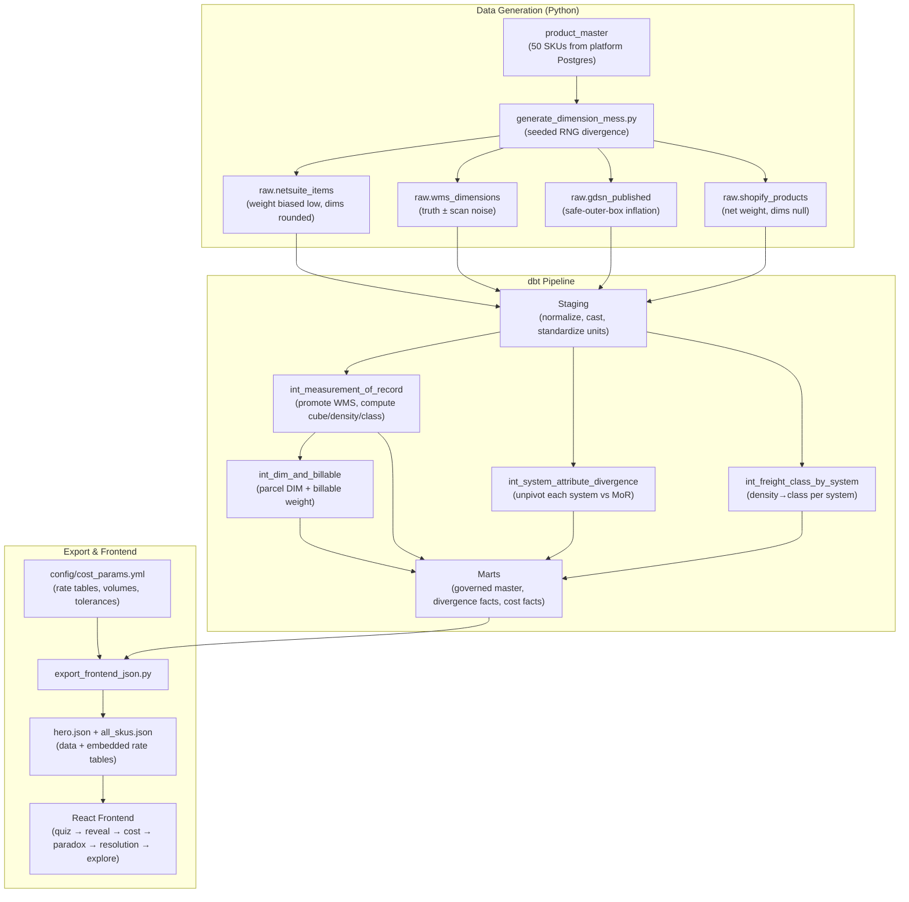

# feat: Dimension & Weight Integrity — Discovery Narrative + Data Pipeline

## Summary

Standalone project following the Cinderhaven portfolio pattern: Python data generation with seeded RNG creates per-system divergence for all 50 SKUs, a local dbt project computes density/class/cost models against the platform Postgres, Dagster orchestrates the pipeline and exports static JSON, and a React + TypeScript + Vite frontend delivers the discovery narrative (quiz → reveal → cost → paradox → resolution → 50-SKU explore). Deployed via Cloudflare Workers.

---

## Problem Frame

Specialty food brands manage product physical attributes across four systems (ERP, WMS, GDSN, DTC) that diverge silently. The divergence drives cost through freight misclassification, parcel reweigh back-bills, and compliance chargebacks. Fixing one channel's data worsens another — the localization paradox. Only governing from a single measured source of truth resolves both channels simultaneously. Full problem context in origin document (see origin: `docs/brainstorms/dimension-weight-integrity-requirements.md`).

---

## Requirements

- R1. Interactive quiz: "Which weight is right?" — viewer commits before reveal
- R2. Reveal: only WMS matches measurement of record; WMS never syncs back
- R3. Three cost drivers shown with per-unit deltas and annual totals
- R4. Paradox toggle: ops fix and DTC fix each worsen the other channel; no all-clean state
- R5. Governed measurement-of-record resolves both channels
- R6. Frontend uses rate tables from exported JSON; no live DB at runtime
- R7. 50-SKU portfolio exploration after hero journey
- R8. Aggregate cost of divergence across all SKUs and drivers
- R9. Physical computations exact and unit-tested (cube, density, NMFC class, DIM weight, billable weight)
- R10. All business parameters in single config file, flagged, not hardcoded
- R11. Like-to-like divergence comparisons (case-gross vs case-gross; parcel-gross vs ship_weight)
- R12. Hero SKU reconciliation invariants hold exactly
- R13. Deliberate per-system divergence patterns for all 50 SKUs
- R14. Seeded deterministic data generation
- R15. Physical-attribute field ownership boundary with Product Data Health Audit
- R16. Cost parameters benchmarked against published industry data, honestly framed
- R17. Exact-vs-parameter distinction visible in codebase

**Origin actors:** A1 (Portfolio viewer), A2 (Ops/finance practitioner), A3 (Cinderhaven Data Platform)
**Origin flows:** F1 (Discovery journey — hero SKU), F2 (Portfolio exploration — 50-SKU), F3 (Data pipeline — build-time)
**Origin acceptance examples:** AE1 (covers R1, R2), AE2 (covers R4), AE3 (covers R9, R12), AE4 (covers R11)

---

## Scope Boundaries

- No live database connection at frontend runtime
- No real retailer data or client deployments
- No user-adjustable rate parameters in the frontend
- No integration with external systems (EDI, retailer portals, real WMS)
- No mobile-first design (responsive sufficient)
- No overlap with Product Data Health Audit's structural completeness scope
- No multi-tenant or SaaS architecture

### Deferred to Follow-Up Work

- Rate sensitivity analysis / "plug in your own numbers" mode: future iteration
- Client adaptation guide: document after v1 ships
- Cross-piece governed master integration (other pieces consuming this piece's MoR): separate effort

---

## Context & Research

### Relevant Code and Patterns

- **cinderhaven-data pipeline**: 17-step deterministic Python pipeline with `rng = random.Random(SEED)` per script, SQLite storage, `scripts/shared.py` for constants. Each script reads tables built by prior ones.
- **product_master**: 50 SKUs × 5 product lines with `case_weight_lbs`, `case_length_in`, `case_width_in`, `case_height_in`, `unit_weight_lbs`, `case_pack_qty`, `gtin14`. Some SKUs have NULL dimensions.
- **chargebacks table**: ~391 rows with `defect_reason` including "Dimension mismatch". Has `sku`, `retailer_id`, `amount`.
- **Frontend export pattern**: `20_export_json.py` queries Postgres via `psycopg2`, writes denormalized JSON to `frontend/public/json/`. Custom Decimal/date serializers.
- **Frontend stack**: React 19 + TypeScript + Vite 8 + Cloudflare Workers (used in OTIF, Deduction Recovery, Contract-to-Cash). Playfair Display + Source Sans 3 fonts via @fontsource. Vitest + React Testing Library.
- **Data loading**: Two patterns — import-time (Vite bakes JSON in, used in OTIF for small data) and runtime fetch (Promise.all, used in Deduction Recovery for larger datasets).
- **State management**: React hooks only (useState, useMemo, useEffect). No external state libraries. State lives in App, flows down as props.
- **dbt naming**: `stg_*` (staging), `int_all_*` (intermediate), `fct_*`/`dim_*` (marts). Three schemas: `public_staging`, `public_intermediate`, `public_marts`.

### External References

- **NMFC density-class table**: NMFTA Docket 2025-1 (effective July 2025). Published standard. 18 classes from 50 (≥50 lb/ft³) to 500 (<1 lb/ft³). ~~Classes 50 and 55 added in 2025.~~ [superseded 2026-07: historically false — classes 50 and 55 are long-standing members of the standard 18-class NMFC density scale, not 2025 additions. Shipped code comment corrected accordingly.]
- **Parcel rates**: FedEx Ground Zone 5 2026 list rates — 1 lb: $14.00, 2 lb: $15.66, 3 lb: $16.81, 4 lb: $17.73, 5 lb: $18.53. Source: Quadient/FedEx Rate Guide 2026.
- **DIM divisors**: FedEx and UPS both use 139 (all domestic). USPS changing from 166 to 139 in July 2026. Source: carrier official documentation.
- **DIM rounding**: As of August 2025, FedEx and UPS round each fractional dimension up to nearest whole inch before computing DIM weight.
- **LTL class-step cost**: 15-25% cost increase per class step (industry benchmark, not published tariff). Reclassification inspection fee: $75-$150/shipment. Source: logistics practitioner guides.
- **Chargebacks**: Walmart SQEP $200 base per defect category per PO + $4/non-compliant pallet. Costco 2% of invoice for non-compliant packaging. Industry-wide: 2-10% of annual revenue for non-compliant suppliers. Source: Inmar Inc., Walmart Supplier Center, Industrial Packaging.
- **Dimension-specific chargeback %**: Not published as a standalone category. Model as a subset of pallet/packaging violations. Label as modeled assumption.

---

## Key Technical Decisions

- **Standalone project, not platform-integrated**: This repo contains its own dbt project, data generation, Dagster orchestration, and frontend. Connects to platform Postgres for product_master base data but does not add models to the platform repo. Follows the pattern of every other portfolio piece (OTIF, Deduction Recovery, Contract-to-Cash are all standalone repos).
- **React 19 + TypeScript + Vite 8 for frontend**: Established portfolio stack. No framework decision overhead. State management via React hooks. Observable Plot for data comparisons.
- **Import-time JSON loading (Pattern A)**: Hero SKU + 50-SKU data is small (<500KB total). Vite bakes JSON into the bundle at build time — no loading states, no fetch errors. Follows otif-blind-spot pattern.
- **Cost parameters updated to 2026 industry benchmarks**: Build spec's illustrative rates replaced with defensible numbers sourced from published carrier rates and NMFTA standards. Per-unit deltas recomputed to match. The formulas and approach are unchanged; only the parameter values update.
- **Parcel rates use discounted estimate, not list price**: Published FedEx Zone 5 list is $14.00/$15.66/$16.81 for 1/2/3 lb. Model at ~30% discount (typical small-brand negotiated rate): $9.80/$10.96/$11.77. Cite list rates as baseline.
- **LTL rates modeled as plausible stand-ins**: No per-class public tariff exists. Use $18.00/cwt (class 50) and $19.80/cwt (class 55) from build spec — a 10% step increase, conservative vs. the 15-25% industry range. Label as "modeled stand-in based on industry benchmarks."

---

## Open Questions

### Resolved During Planning

- **Frontend framework**: React 19 + TypeScript + Vite 8 — follows established portfolio pattern
- **Data generation approach**: Standalone Python scripts with seeded RNG in this repo, reading product_master from platform Postgres
- **Portfolio view design**: Sortable table with summary KPIs, following retailer-deduction-recovery's exploration pattern
- **Industry sources**: NMFC from NMFTA (published), parcel rates from FedEx/UPS 2026 (published), LTL as relative cost (benchmark), chargebacks from Walmart SQEP + Inmar (mixed)
- **DIM divisor**: 139 (FedEx/UPS current standard)

### Deferred to Implementation

- Exact per-SKU divergence amounts (generated by seeded RNG with configurable ranges — final values determined at generation time)
- Final annual volumes per SKU (DTC orders, pallet shipments) — must be consistent with other Cinderhaven datasets
- Chart component selection (Observable Plot vs Recharts) — decide per-view during frontend implementation based on data shape
- Cloudflare Workers deployment config — copy from existing portfolio piece and adapt

---

## Output Structure

```
dimension-weight-integrity/
├── config/
│   └── cost_params.yml                    # All business parameters (rates, volumes, tolerances)
├── data_gen/
│   ├── generate_dimension_mess.py         # Synthetic divergence generator (50 SKUs × 4 systems)
│   └── shared.py                          # Constants, RNG helpers, DB connection
├── dbt/
│   ├── dbt_project.yml
│   ├── profiles.yml
│   ├── macros/
│   │   ├── cube_ft3.sql
│   │   ├── density_to_nmfc_class.sql
│   │   ├── dim_weight_lb.sql
│   │   └── billable_weight_lb.sql
│   ├── models/
│   │   ├── staging/
│   │   │   ├── stg_netsuite_items.sql
│   │   │   ├── stg_wms_dimensions.sql
│   │   │   ├── stg_gdsn_published.sql
│   │   │   └── stg_shopify_products.sql
│   │   ├── intermediate/
│   │   │   ├── int_measurement_of_record.sql
│   │   │   ├── int_system_attribute_divergence.sql
│   │   │   ├── int_freight_class_by_system.sql
│   │   │   └── int_dim_and_billable.sql
│   │   └── marts/
│   │       ├── fct_governed_product_master.sql
│   │       ├── fct_attribute_divergence.sql
│   │       ├── fct_freight_class_by_system.sql
│   │       └── fct_dimension_cost.sql
│   ├── tests/
│   │   └── divergence_monitor.sql
│   └── unit_tests/
│       └── test_macros.sql
├── dagster/
│   ├── assets.py                          # Asset graph: generate → load → dbt → export
│   └── definitions.py                     # Dagster Definitions entry point
├── scripts/
│   └── export_frontend_json.py            # Marts → hero.json + all_skus.json
├── frontend/
│   ├── package.json
│   ├── vite.config.ts
│   ├── tsconfig.json
│   ├── wrangler.jsonc
│   ├── public/
│   │   └── data/
│   │       ├── hero.json
│   │       └── all_skus.json
│   └── src/
│       ├── main.tsx
│       ├── App.tsx
│       ├── types.ts
│       ├── data.ts
│       ├── domain.ts                      # Cost computation, paradox logic
│       ├── components/
│       │   ├── QuizView.tsx
│       │   ├── CostReveal.tsx
│       │   ├── ParadoxToggle.tsx
│       │   ├── GovernanceResolution.tsx
│       │   ├── PortfolioView.tsx
│       │   └── ChapterNav.tsx
│       └── utils/
│           └── format.ts
├── tests/
│   ├── test_data_gen.py
│   ├── test_cost_math.py
│   ├── test_export.py
│   └── test_e2e_reconciliation.py         # Hero SKU end-to-end invariant checks
└── docs/
    ├── brainstorms/
    │   └── dimension-weight-integrity-requirements.md
    └── plans/
        └── 2026-06-04-001-feat-dimension-weight-integrity-plan.md
```

---

## High-Level Technical Design

> *This illustrates the intended approach and is directional guidance for review, not implementation specification. The implementing agent should treat it as context, not code to reproduce.*



---

## Implementation Units

### U1. Cost Parameters Config

**Goal:** Create the single config file that holds all business parameters, establishing the exact-vs-parameter boundary.

**Requirements:** R10, R16, R17

**Dependencies:** None

**Files:**
- Create: `config/cost_params.yml`
- Test: `tests/test_cost_math.py` (parameter loading validation)

**Approach:**
- All `# PARAM`-flagged values from the build spec go here: LTL $/cwt rate table, parcel $/lb rate table, DIM divisor, annual pallet shipments, annual DTC orders per SKU, chargeback $/event, events/year, drift tolerance
- Update parcel rates to 2026-benchmarked values (discounted from published FedEx/UPS Zone 5 list rates)
- LTL rates use build spec's $18.00/$19.80 per cwt (conservative, defensible as modeled stand-in)
- Include inline comments citing the industry source for each parameter
- YAML format for human readability; Python loads via PyYAML

**Patterns to follow:**
- `config/products.yaml` in competitive-shelf-intelligence for config file structure

**Test scenarios:**
- Happy path: config loads successfully, all expected keys present with correct types
- Happy path: LTL rate table maps class 50 and class 55 to the configured $/cwt values
- Happy path: parcel rate table maps 1/2/3/4/5 lb tiers to configured $/lb values
- Edge case: config with missing key raises clear error naming the missing parameter

**Verification:**
- `config/cost_params.yml` exists with all parameters documented and sourced
- No magic numbers in any downstream model or script — all reference this config

---

### U2. dbt Macros with Unit Tests

**Goal:** Implement the exact physical computations as reusable dbt macros with comprehensive unit tests.

**Requirements:** R9, R12, R17

**Dependencies:** None

**Files:**
- Create: `dbt/macros/cube_ft3.sql`
- Create: `dbt/macros/density_to_nmfc_class.sql`
- Create: `dbt/macros/dim_weight_lb.sql`
- Create: `dbt/macros/billable_weight_lb.sql`
- Create: `dbt/dbt_project.yml`
- Create: `dbt/profiles.yml`
- Test: `dbt/unit_tests/test_macros.sql`

**Approach:**
- `cube_ft3(l, w, h)` = `(l * w * h) / 1728`
- `density_to_nmfc_class(density)` = full NMFTA Docket 2025-1 density band table (18 classes from 50 to 500). Implemented as a CASE expression with exact breakpoints.
- `dim_weight_lb(l, w, h, divisor)` = `(l * w * h) / divisor`
- `billable_weight_lb(actual, dim)` = `ceil(greatest(actual, dim))`
- dbt project configured to connect to platform Postgres (Fly.io) with raw/staging/intermediate/marts schemas

**Patterns to follow:**
- dbt macro syntax conventions from the Cinderhaven platform

**Test scenarios:**
- Covers AE3. Happy path: `cube_ft3(11.25, 8.5, 5.25)` = 0.29053
- Happy path: `density_to_nmfc_class(74.0)` = 50 (hero SKU MoR)
- Happy path: `density_to_nmfc_class(37.98)` = 55 (GDSN published density)
- Happy path: `density_to_nmfc_class(13.0)` = 85
- Happy path: `dim_weight_lb(6, 6, 6, 139)` ≈ 1.554
- Happy path: `billable_weight_lb(2.05, 1.554)` = 3
- Edge case: `density_to_nmfc_class(50.0)` = 50 (exact boundary — density ≥ 50)
- Edge case: `density_to_nmfc_class(49.99)` = 55 (just below boundary)
- Edge case: `billable_weight_lb(3.0, 3.0)` = 3 (exact integer — no rounding needed)
- Edge case: `density_to_nmfc_class(3.5)` = 250 (low-density extreme)
- Edge case: `density_to_nmfc_class(0.5)` = 500 (lowest class)

**Verification:**
- All macro unit tests pass
- Hero SKU reconciliation invariants confirmed: cube 0.29053, density 74.0, class 50

---

### U3. Synthetic Data Generation

**Goal:** Generate deterministic per-system divergence data for all 50 Cinderhaven SKUs.

**Requirements:** R13, R14, R15

**Dependencies:** U1

**Files:**
- Create: `data_gen/generate_dimension_mess.py`
- Create: `data_gen/shared.py`
- Test: `tests/test_data_gen.py`

**Approach:**
- Connect to platform Postgres, read `product_master` for the 50-SKU base data (sku, product_name, unit_weight_lbs, case_weight_lbs, case_length/width/height_in, case_pack_qty)
- WMS = truth: copy base data ± small scan noise (≤1% jitter on weight, ±0.25" on dims)
- ERP (NetSuite): weight biased low 3-8%, dims rounded to nearest inch, ~20% get unit/case weight confusion (unit_weight entered in case_weight field), ti/hi off by 1 on ~15%
- GDSN (IX-ONE): dims inflated +10-25% per axis on ~40% of SKUs (safe outer box), weight rounded up to nearest 0.5 lb, ti/hi off by 1 on ~10%
- Shopify: ship_weight = unit_net_weight (systematic under-weight), dims null ~80%
- Each system's data written to CSV in `data/generated/`
- Seeded RNG: `rng = random.Random(42)` for reproducibility
- Hero SKU (CH-MAR-16) values hardcoded to match build spec §2.2 exactly

**Patterns to follow:**
- `scripts/shared.py` in cinderhaven-data for constants and DB connection helpers
- `rng = random.Random(SEED)` pattern used throughout cinderhaven-data pipeline

**Test scenarios:**
- Happy path: generation produces 4 CSV files (netsuite, wms, gdsn, shopify), each with 50 rows
- Happy path: running twice with same seed produces identical output (byte-for-byte)
- Covers AE3. Happy path: hero SKU WMS row matches MoR exactly (21.50 lb, 11.25×8.5×5.25)
- Covers AE1. Happy path: hero SKU ERP row has case_weight 20.00 (biased low) and unit_weight 1.00 (net in gross field)
- Happy path: hero SKU GDSN row has dims 13×11×7 and weight 22.00
- Happy path: hero SKU Shopify row has ship_weight 1.00 and null dims
- Edge case: all ERP weights are lower than WMS weights (systematic bias direction)
- Edge case: ~20% of ERP SKUs have unit_weight_lbs = case_weight_lbs (unit/case confusion)
- Edge case: ~80% of Shopify rows have null dims
- Integration: generated CSVs load cleanly into Postgres raw tables (column names, types match)

**Verification:**
- 4 CSV files in `data/generated/` with deterministic content
- Hero SKU values match build spec §2.2 per-system table exactly
- No SKU missing from any system file

---

### U4. dbt Staging Models

**Goal:** Normalize the four raw source tables into a consistent schema.

**Requirements:** R11

**Dependencies:** U2, U3

**Files:**
- Create: `dbt/models/staging/stg_netsuite_items.sql`
- Create: `dbt/models/staging/stg_wms_dimensions.sql`
- Create: `dbt/models/staging/stg_gdsn_published.sql`
- Create: `dbt/models/staging/stg_shopify_products.sql`
- Create: `dbt/models/staging/schema.yml` (tests + docs)

**Approach:**
- Cast all types explicitly (text → numeric, etc.)
- Standardize column names across systems (e.g., `pub_case_weight_lb` → `case_gross_weight_lb`)
- Normalize units (all weights in lb, all dimensions in inches)
- Preserve the `system` origin as a column for downstream unpivoting
- Do NOT compute derived fields here — that's intermediate layer

**Patterns to follow:**
- `stg_*` naming convention from platform
- Column name standardization patterns

**Test scenarios:**
- Happy path: each staging model produces 50 rows (one per SKU)
- Happy path: all weight columns are numeric and positive
- Happy path: column names are standardized across all four models
- Edge case: Shopify dims (mostly null) pass through as null without error
- Edge case: GDSN rows with non-standard dim naming map correctly

**Verification:**
- `dbt build --select staging` passes
- All four staging models queryable with consistent column names

---

### U5. dbt Intermediate Models

**Goal:** Compute the measurement of record, divergence analysis, freight classification, and billable weight.

**Requirements:** R9, R11, R12

**Dependencies:** U2, U4

**Files:**
- Create: `dbt/models/intermediate/int_measurement_of_record.sql`
- Create: `dbt/models/intermediate/int_system_attribute_divergence.sql`
- Create: `dbt/models/intermediate/int_freight_class_by_system.sql`
- Create: `dbt/models/intermediate/int_dim_and_billable.sql`
- Create: `dbt/models/intermediate/schema.yml`

**Approach:**
- `int_measurement_of_record`: Promote WMS as MoR source. Compute cube, density, freight class via macros. Set `mor_source = 'WMS'`.
- `int_system_attribute_divergence`: Unpivot each system vs MoR. One row per sku × system × field. Compute abs_delta, pct_delta, flagged (beyond drift tolerance from config). **Critical: compare like-to-like.** Retail = case_gross vs case_gross. DTC = dtc_parcel_gross_lb vs ship_weight_lb.
- `int_freight_class_by_system`: Compute density and freight class for each system's stored dims using the density_to_nmfc_class macro.
- `int_dim_and_billable`: Compute DIM weight and billable weight per SKU for the DTC parcel path.

**Patterns to follow:**
- `int_all_*` naming from platform (though these are `int_*` since they're not cross-channel unions)

**Test scenarios:**
- Covers AE3. Happy path: hero SKU MoR has cube=0.29053, density=74.0, class=50
- Covers AE4. Happy path: hero SKU DTC divergence uses parcel_gross (2.05) vs ship_weight (1.00), not case_gross
- Happy path: hero SKU GDSN freight class = 55 (density 37.98)
- Happy path: hero SKU billable weight = 3 lb (actual 2.05 > DIM 1.554, ceil = 3)
- Covers AE1. Happy path: hero SKU WMS divergence shows zero delta (WMS = MoR)
- Happy path: hero SKU ERP divergence flags weight discrepancy (20.0 vs 21.5)
- Edge case: SKU with DIM weight > actual weight → billable weight = ceil(DIM weight)
- Edge case: SKU with actual weight > DIM weight → billable weight = ceil(actual weight)

**Verification:**
- `dbt build --select intermediate` passes
- Hero SKU reconciliation invariants hold across all intermediate models

---

### U6. dbt Mart Models

**Goal:** Produce the business-facing fact tables the frontend and export consume.

**Requirements:** R3, R7, R8, R10, R12

**Dependencies:** U1, U5

**Files:**
- Create: `dbt/models/marts/fct_governed_product_master.sql`
- Create: `dbt/models/marts/fct_attribute_divergence.sql`
- Create: `dbt/models/marts/fct_freight_class_by_system.sql`
- Create: `dbt/models/marts/fct_dimension_cost.sql`
- Create: `dbt/models/marts/schema.yml` (contracts)

**Approach:**
- `fct_governed_product_master`: The merged "after" — MoR values for all physical attributes, all 50 SKUs.
- `fct_attribute_divergence`: Long/tidy format — one row per sku × system × field. Includes system_value, mor_value, abs_delta, pct_delta, flagged.
- `fct_freight_class_by_system`: One row per sku × system with density and computed freight class.
- `fct_dimension_cost`: One row per sku × driver ('ltl_reclass', 'parcel_reweigh', 'compliance_cb'). Columns: per_unit_delta, annual_units (from config), annual_cost, basis (JSONB with computation inputs). Annual_cost = per_unit_delta × annual_units.
- Cost computation reads rate tables from config (loaded via dbt vars or seed).

**Patterns to follow:**
- `fct_*` naming from platform
- dbt contract enforcement on mart models

**Test scenarios:**
- Happy path: governed master has 50 rows, one per SKU, all fields non-null
- Happy path: hero SKU ltl_reclass per_unit_delta matches config-driven computation
- Happy path: hero SKU parcel_reweigh per_unit_delta = parcel_rate[billable_lb] - parcel_rate[shopify_lb]
- Happy path: fct_dimension_cost.annual_cost = per_unit_delta × annual_units for all rows
- Happy path: fct_dimension_cost.basis JSONB includes computation inputs for traceability
- Edge case: SKU where GDSN class = MoR class → ltl_reclass per_unit_delta = 0

**Verification:**
- `dbt build --select marts` passes with contracts enforced
- Hero SKU cost deltas reconcile to config-driven rates

---

### U7. dbt Tests and Divergence Monitor

**Goal:** Add data quality tests, contract enforcement, and the divergence monitoring test.

**Requirements:** R9, R11, R12

**Dependencies:** U5, U6

**Files:**
- Create: `dbt/tests/divergence_monitor.sql`
- Modify: `dbt/models/staging/schema.yml` (add tests)
- Modify: `dbt/models/intermediate/schema.yml` (add tests)
- Modify: `dbt/models/marts/schema.yml` (add contracts + tests)

**Approach:**
- `unique` + `not_null` on governed master SKU
- `accepted_range` on weights (>0), density (>0), freight_class in valid set
- dbt contracts on `fct_dimension_cost` and `fct_governed_product_master` (enforce column names/types)
- Divergence monitor: custom singular test that warns when `abs_delta` for a gross-weight field exceeds `drift_tolerance_lb` from config. Severity `warn`, not error. Must fire for ERP/GDSN/Shopify on hero SKU; must NOT fire for WMS.

**Test scenarios:**
- Happy path: `dbt test` passes — all unique/not_null/accepted_range tests green
- Happy path: divergence monitor emits warn for ERP weight on hero SKU (delta = 1.5 lb > tolerance)
- Happy path: divergence monitor does NOT warn for WMS on hero SKU (delta ≈ 0)
- Happy path: mart contracts enforce expected column names and types
- Edge case: divergence monitor emits warn for GDSN dims but not GDSN weight when weight is within tolerance

**Verification:**
- `dbt build` (models + tests) passes end-to-end
- Divergence monitor output shows expected warn/no-warn pattern

---

### U8. Frontend JSON Export

**Goal:** Query mart tables and produce the static JSON files the frontend consumes.

**Requirements:** R6, R10, R12

**Dependencies:** U1, U6

**Files:**
- Create: `scripts/export_frontend_json.py`
- Test: `tests/test_export.py`

**Approach:**
- Connect to Postgres, query marts
- Produce `hero.json` matching the build spec §6 data contract shape: hero_sku (measurement_of_record + systems array), cost (per-driver deltas and annuals), rate_tables (for client-side recomputation), paradox (ops_fix and dtc_fix descriptions)
- Produce `all_skus.json` with divergence and cost data for all 50 SKUs
- Embed rate tables from config into the JSON so the paradox toggle can recompute client-side
- Output to `frontend/public/data/`
- Custom JSON serializers for Decimal → float, date → ISO string

**Patterns to follow:**
- `scripts/20_export_json.py` in retailer-deduction-recovery for Postgres query → JSON export pattern
- Decimal/date serializer pattern from the same script

**Test scenarios:**
- Happy path: export produces hero.json and all_skus.json
- Happy path: hero.json matches build spec §6 schema (all expected keys present)
- Happy path: hero.json rate_tables include LTL per_cwt and parcel per_lb from config
- Happy path: hero.json cost annual values = per_unit × annual_units
- Happy path: all_skus.json has 50 entries
- Edge case: SKU with zero cost delta (class matches MoR) has annual_cost = 0

**Verification:**
- Both JSON files valid and parseable
- Hero SKU data in JSON reconciles to dbt mart output

---

### U9. Dagster Asset Graph

**Goal:** Orchestrate the full pipeline as a Dagster asset graph.

**Requirements:** F3

**Dependencies:** U3, U7, U8

**Files:**
- Create: `dagster/assets.py`
- Create: `dagster/definitions.py`

**Approach:**
- Four assets: `generate_source_extracts` → `load_raw` → `dbt_build` → `export_frontend_json`
- `generate_source_extracts`: calls `generate_dimension_mess.py`, writes CSVs
- `load_raw`: reads CSVs, loads into Postgres raw schema
- `dbt_build`: runs `dbt build` (models + tests)
- `export_frontend_json`: runs the export script, writes JSON to frontend/public/data/
- Asset checks mirror the dbt divergence monitor result
- On-demand schedule; daily schedule available for demo purposes

**Patterns to follow:**
- Dagster asset conventions from the Cinderhaven Data Platform

**Test scenarios:**
- Happy path: full asset graph materializes without error
- Happy path: asset check reflects dbt divergence monitor warn state
- Integration: end-to-end: generate → load → build → export produces valid hero.json

**Verification:**
- Dagster UI shows the asset graph with all four assets
- Full materialization produces the same JSON output as running scripts individually

---

### U10. Frontend Scaffold

**Goal:** Set up the React + TypeScript + Vite project with types, data loading, and chapter navigation.

**Requirements:** R6

**Dependencies:** U8

**Files:**
- Create: `frontend/package.json`
- Create: `frontend/vite.config.ts`
- Create: `frontend/tsconfig.json`
- Create: `frontend/tsconfig.app.json`
- Create: `frontend/wrangler.jsonc`
- Create: `frontend/src/main.tsx`
- Create: `frontend/src/App.tsx`
- Create: `frontend/src/types.ts`
- Create: `frontend/src/data.ts`
- Create: `frontend/src/domain.ts`
- Create: `frontend/src/utils/format.ts`
- Create: `frontend/src/components/ChapterNav.tsx`
- Create: `frontend/index.html`
- Test: `frontend/src/components/ChapterNav.test.tsx`

**Approach:**
- `types.ts`: TypeScript interfaces mirroring hero.json schema (HeroSku, System, Cost, RateTables, Paradox)
- `data.ts`: Import-time JSON loading (Pattern A) — `import heroData from '../public/data/hero.json'`
- `domain.ts`: Pure functions for cost computation (reclass delta, parcel leak, billable weight) — these drive the paradox toggle. Uses rate tables from the imported JSON.
- `format.ts`: Currency formatting ($1.2M, $300K), percentage, weight (lb)
- `ChapterNav.tsx`: 5-chapter navigation (Quiz, Reveal+Cost, Paradox, Resolution, Portfolio)
- `App.tsx`: Chapter state via useState, data flows down as props
- Lailara design system: Playfair Display + Source Sans 3 fonts, Canvas background, Economist chart style
- Dependencies: react, react-dom, @fontsource/playfair-display, @fontsource/source-sans-3, @observablehq/plot (or recharts — decide per view)

**Patterns to follow:**
- `frontend/` structure from otif-blind-spot
- `ChapterNav.tsx` pattern from otif-blind-spot
- `format.ts` pattern from retailer-deduction-recovery

**Test scenarios:**
- Happy path: `npm run dev` starts without errors
- Happy path: ChapterNav renders 5 tabs, clicking a tab updates active chapter
- Happy path: format.ts formats $15000 as "$15,000" and $8049.60 as "$8,050"
- Happy path: domain.ts computes billable weight correctly (max(actual, dim), ceil)

**Verification:**
- Dev server starts, blank app renders with chapter navigation
- TypeScript strict mode passes with no errors
- Domain functions unit-tested

---

### U11. Quiz View — "Which Weight Is Right?"

**Goal:** Build the interactive quiz where the viewer commits a guess before the reveal.

**Requirements:** R1, R2

**Dependencies:** U10

**Files:**
- Create: `frontend/src/components/QuizView.tsx`
- Test: `frontend/src/components/QuizView.test.tsx`

**Approach:**
- Present four system cards, each showing that system's stored weight and dims for CH-MAR-16
- Viewer clicks one card to commit their guess
- After commitment, reveal which systems match/don't match the MoR
- Only WMS matches — highlight it. Show why others are wrong (ERP: net-in-gross, GDSN: safe-outer-box, Shopify: net weight)
- State: `selectedSystem: string | null`, `revealed: boolean`
- Pre-reveal: all four cards selectable. Post-reveal: correct answer highlighted, others dimmed with annotation
- Lailara design: cards use London greyscale, selected card uses Chicago navy accent, correct answer uses HK teal

**Test scenarios:**
- Covers AE1. Happy path: clicking "NetSuite ERP" marks it selected, reveal shows ERP is wrong (20.0 vs 21.5 MoR)
- Happy path: clicking "3PL / WMS" and revealing shows WMS matches MoR
- Happy path: before selection, no reveal is possible (button disabled or hidden)
- Happy path: after reveal, all four systems show their divergence annotation
- Edge case: clicking a different system before reveal changes selection
- Edge case: after reveal, cannot re-select (cards are locked)

**Verification:**
- Quiz renders four system cards with hero SKU data
- Selection + reveal flow works end-to-end
- Visual styling matches Lailara design system

---

### U12. Cost Reveal View

**Goal:** Show the three cost drivers with per-unit deltas and annualized totals.

**Requirements:** R3, R16

**Dependencies:** U10

**Files:**
- Create: `frontend/src/components/CostReveal.tsx`
- Test: `frontend/src/components/CostReveal.test.tsx`

**Approach:**
- Three sections: LTL freight reclass, Parcel reweigh back-bill, Compliance chargebacks
- Each section shows: the specific divergence causing the cost, per-unit delta with math, annual total
- LTL: GDSN density 37.98 → class 55 vs MoR class 50; rate delta × cwt × annual pallets
- Parcel: Shopify 1 lb vs actual 2.05 lb → billable 3 lb; rate delta × annual orders
- Chargeback: published dims ≠ physical → DC flags; $/event × events/year
- All dollar values from hero.json cost object
- Cite parameter sources (footnotes or inline citations per Economist style)

**Test scenarios:**
- Happy path: three cost driver sections render with correct per-unit and annual amounts
- Happy path: LTL section shows class 50 vs class 55 comparison
- Happy path: parcel section shows 1 lb (Shopify) vs 3 lb (billable) comparison
- Happy path: total annual cost shown as sum of three drivers
- Edge case: cost values formatted correctly ($15.48, not $15.48000)

**Verification:**
- All three cost drivers display with correct math
- Total annual cost is sum of the three individual annual costs
- Source citations present

---

### U13. Paradox Toggle View

**Goal:** Build the interactive toggle that demonstrates fixing one channel breaks the other.

**Requirements:** R4, R5, R6

**Dependencies:** U10

**Files:**
- Create: `frontend/src/components/ParadoxToggle.tsx`
- Create: `frontend/src/components/GovernanceResolution.tsx`
- Test: `frontend/src/components/ParadoxToggle.test.tsx`

**Approach:**
- Toggle states: "None" (current state), "Ops Fix" (align GDSN to physical), "DTC Fix" (correct Shopify weight)
- When toggled, recompute costs CLIENT-SIDE from rate_tables in the JSON:
  - Ops fix: GDSN density → MoR density (74.0), class drops from 55 to 50 → retail freight improves. BUT DTC parcel leak unchanged.
  - DTC fix: Shopify weight → actual parcel (2.05) → parcel back-bill disappears. BUT quoted shipping cost rises for customer.
- Show both channels side by side. When one improves, highlight the other worsening (red/warning).
- No toggle combination shows both channels clean.
- Below the toggle: GovernanceResolution component shows that the governed MoR clears both simultaneously.
- Toggle uses the domain.ts pure functions for recomputation.
- Lailara: Singapore orange for warning/worsening, HK teal for improvement

**Test scenarios:**
- Covers AE2. Happy path: "Ops Fix" toggle → retail freight class improves (55→50), DTC unchanged (still leaking)
- Covers AE2. Happy path: "DTC Fix" toggle → parcel leak removed, retail unchanged
- Happy path: "None" shows current (broken) state for both channels
- Happy path: no toggle state exists where both channels show zero cost delta
- Happy path: recomputation uses rate_tables from JSON, not hardcoded values
- Edge case: rapid toggling between states produces correct values each time
- Integration: domain.ts reclass and parcel functions produce correct numbers for each toggle state

**Verification:**
- Toggle switches between three states, both channels update reactively
- No all-clean state reachable
- GovernanceResolution shows the MoR clearing both channels

---

### U14. Portfolio View — 50-SKU Exploration

**Goal:** Let the viewer explore divergence and cost across all 50 Cinderhaven SKUs.

**Requirements:** R7, R8

**Dependencies:** U10

**Files:**
- Create: `frontend/src/components/PortfolioView.tsx`
- Test: `frontend/src/components/PortfolioView.test.tsx`

**Approach:**
- Summary KPIs at top: total annual cost of divergence, number of SKUs with class mismatches, worst-offending SKUs
- Sortable table: SKU, product name, product line, MoR weight, worst system divergence, annual cost (all 3 drivers summed)
- Click a row to expand: show per-system divergence detail and per-driver cost breakdown for that SKU
- Data from all_skus.json (loaded at import-time alongside hero.json)
- Sort by annual cost descending by default (worst offenders first)
- Lailara: HK sequential teal for magnitude ranking in any charts, London greyscale for table

**Test scenarios:**
- Happy path: portfolio view renders 50 rows in the table
- Happy path: summary KPIs show aggregate cost across all SKUs
- Happy path: table is sortable by annual cost, SKU name, product line
- Happy path: clicking a row expands to show per-system divergence detail
- Happy path: hero SKU (CH-MAR-16) row matches the hero journey cost data
- Edge case: SKU with zero total cost (all systems match MoR) shows $0

**Verification:**
- Table renders all 50 SKUs with correct data
- Aggregate cost is sum of all individual SKU costs
- Sorting and expansion work correctly

---

### U15. End-to-End Validation and Polish

**Goal:** Verify the full pipeline produces correct output, the frontend matches the data, and the piece is deployment-ready.

**Requirements:** R12, all acceptance examples

**Dependencies:** U9, U11, U12, U13, U14

**Files:**
- Create: `tests/test_e2e_reconciliation.py`
- Modify: `frontend/src/App.tsx` (chapter flow, transitions)
- Modify: `README.md` (update with run instructions, stack, deployment)

**Approach:**
- Python reconciliation script that validates hero.json against expected values (cube, density, class, deltas)
- Verify all acceptance examples (AE1-AE4) hold in the rendered frontend
- Add chapter transitions (progress through quiz → reveal → cost → paradox → resolution → portfolio)
- Polish: responsive layout, print stylesheet (SVG charts, white background, running footer), accessibility (aria-labels, focus-visible)
- Update README with full run instructions, stack description, deployment process

**Test scenarios:**
- Covers AE1-AE4. Integration: hero.json reconciliation — cube=0.29053, density=74.0, class=50, GDSN class=55
- Integration: full pipeline (generate → load → dbt → export → frontend) produces a working site
- Happy path: chapter navigation progresses through all 5 chapters in order
- Happy path: responsive layout works at mobile breakpoint (640px)
- Edge case: print stylesheet produces clean output without interactive elements

**Verification:**
- Reconciliation script passes with zero failures
- Frontend renders the full discovery journey end-to-end
- `npm run build` succeeds, `npm run deploy` deploys to Cloudflare
- README accurately describes the project, stack, and run instructions

---

## System-Wide Impact

- **Interaction graph:** Data generation reads from platform Postgres (product_master). dbt models query raw tables populated by the generator. Export script queries dbt marts. Frontend consumes exported JSON. No runtime callbacks or middleware.
- **Error propagation:** Pipeline failures propagate through Dagster asset dependencies — a failed generation blocks dbt, a failed dbt blocks export. Frontend is decoupled (consumes static files).
- **State lifecycle risks:** No persistent state beyond the Postgres tables and exported JSON. Re-running the pipeline is idempotent (seeded RNG produces identical data; dbt models are full-refresh).
- **API surface parity:** N/A — no external APIs.
- **Integration coverage:** The critical integration path is generate → load → dbt → export → frontend. The reconciliation test (U15) covers this end-to-end.
- **Unchanged invariants:** Product Data Health Audit's structural completeness scope is not affected. Platform Postgres product_master is read-only from this project's perspective.

---

## Risks & Dependencies

| Risk | Mitigation |
|------|------------|
| Platform Postgres unavailable during development | Data gen can cache product_master locally; dbt profiles.yml supports local Postgres fallback |
| Parcel rate parameters become outdated | Config-driven; update cost_params.yml annually. Cite publication date in config comments |
| Hero SKU reconciliation breaks during parameter updates | Reconciliation test (U15) catches any drift immediately |
| 50-SKU divergence patterns feel artificial | Tune RNG ranges in data_gen to produce realistic distributions; validate against industry divergence surveys |
| Frontend bundle too large with all-SKU data | Import-time pattern (Pattern A) should handle <500KB easily; monitor bundle size during build |

---

## Documentation / Operational Notes

- Update `README.md` with full project description, run instructions, stack, and deployment (handled in U15)
- Add project to Cinderhaven portfolio index when deployed
- config/cost_params.yml serves as living documentation for all business parameters — keep source citations current

---

## Sources & References

- **Origin document:** [dimension-weight-integrity-requirements.md](docs/brainstorms/dimension-weight-integrity-requirements.md)
- **Build spec:** [build_spec_dimension_integrity.md](build_spec_dimension_integrity.md)
- **NMFC standard:** NMFTA Docket 2025-1, classitplus.nmfta.org
- **Parcel rates:** FedEx Standard List Rates 2026 (Quadient), UPS Daily Rates 2026 (Quadient)
- **DIM divisors:** FedEx official DIM weight documentation, Sifted 2025-2026 analysis
- **Chargeback benchmarks:** Walmart SQEP (Surpass Solutions), Inmar Inc. CPG chargeback estimates
- **LTL benchmarks:** Red Stag Fulfillment LTL rate index, Jansson LLC reclassification guide
- **Portfolio frontend pattern:** otif-blind-spot, retailer-deduction-recovery, contract-to-cash repos
- **Data generation pattern:** cinderhaven-data pipeline (17-step seeded RNG)
